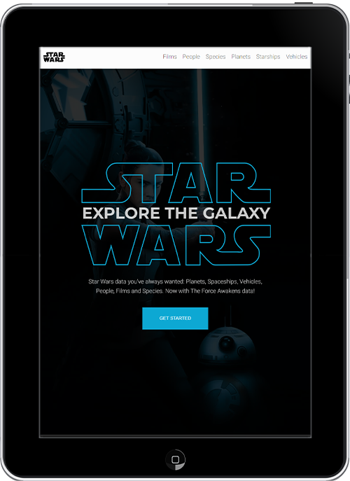

# Star wars

A galaxy far, far away — brought to life through the Star Wars API. This app explores characters, species, planets, starships and vehicles from the first seven films, wrapped in a clean, responsive UI that encourages discovery.

Unlike many typical “first API” projects, this one goes a step further. Since SWAPI doesn’t provide any imagery, I created a complete set of custom visuals — including stylised profile images and environment backdrops — and tied them into the API data using a consistent naming strategy. Combined with bespoke SVG icons and themed layouts, the result is a much more immersive, visually distinct experience. (Movie posters were sourced separately.)

## Features

- Responsive layout and optimised images
- Infinite scroll for smooth data loading
- Custom SVG icons and stylised imagery
- Dynamic routing for all content types

### Content Structure

#### Films

- Episode info, release details, director, producers
- Opening crawl and linked stats (characters, planets, species, starships, vehicles)

#### People

- Full profile views with birth info, species, homeworld, and appearances
- Linked filmography, vehicles, and starships

#### Species

- Classification, average lifespan, physical traits, language and linked people/films

#### Planets

- Climate, terrain, gravity, population, and resident profiles

#### Starships & Vehicles

- Specs: crew, capacity, speed, model, class, consumables
- Linked appearances and pilots/drivers

Each section includes category cards, detail pages, and stylised visuals tied to the data via a dynamic naming system.

## Core Technologies

- HTML5
- Sass(Scss)
- TypeScript
- React
- React query

## APIs

- [SWAPI](https://swapi.py4e.com)
- Native Fetch
- Intersection Observer API

## Third party

- [React icons](https://react-icons.github.io/react-icons)
- [React router](https://reactrouter.com/en/main)
- [React query](https://tanstack.com/query/latest/docs/react/overview)

## Design tools

- Adobe Photoshop
- Adobe Illustrator

## Live site

[Star Wars](https://star-wars-ts.netlify.app/)
